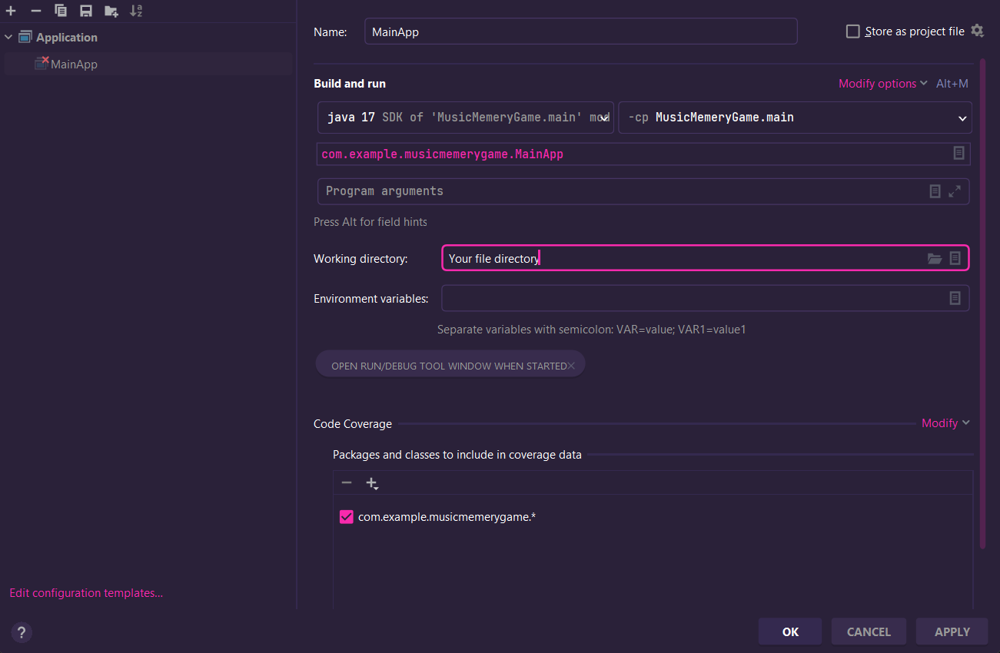

# Black Jack
Made a classic card game using 52 deck of card in javaFx framework

## How to run the project

required to run in IntelliJ

*If the program doesn't run, use this configuration*

</img>       

## Demo

</img>

Instructor:<a href="https://github.com/hoangdesu">@hoangdesu</a>